# Lecture 18 Notes

Table of Contents

1. Stereo Vision
    1. Visual Cues for 3D
    2. Stereo Reconstruction
2. Epipolar Geometry
    1. Introduction
    2. Transformation matrices
3. Parallel Images and Image Rectification
    1. Simplest Case: Parallel Images
    2. Essential Matrix for Parallel Images
    3. Triangulation: Depth from Disparity
    4. Stereo Image Rectification
    5. Rectification Example and Application
4. Solving the Correspondence Problem
    1. Basic Stereo Matching Algorithm
    2. Correspondence Problem
    3. Correspondence Search with Similarity Constraint
    4. Effect of Window Size
    5. Limitations of Similarity Constraint
    6. Results with Window Search
    7. The Role of Baseline

# Stereo Vision

**Motivation.** In this section we will introduce the problem of recovering the 3D world from 2D images. This is the reverse of what we have covered in the past where we mapped 3D co-ordinates to a 2D image. We plan to find ways of automatically computing 3d geometry from images. To do this, we have to explore various visual cues that we can get from 2D images but will help us get a sense of depth in the picture.

### Visual Cues for 3D

**Shading.** Different shadows and shading can give you information on the geometry of an object. You can also get more information about an object if you have images of it in different lighting conditions. Look at these drawings for example.

[https://www.math.brown.edu/~banchoff/DrawingTutorial/3dshading.html](https://www.math.brown.edu/~banchoff/DrawingTutorial/3dshading.html)

We can see that the light source is directly on top of all of them, this makes the point closets to the light source (the top of the object) brighter, and in these cases, completely white. the further any point is from the light source the darker it gets and if a point is completely black we know no light reaches it at all. Although our examples only show what happens in the y direction, the same would be true if there was any light in the z direction. We can then use the different shades of color to determine the z-depth of different parts of an image.

**Texture.** If we can tell which parts of the image have a particular texture and how the textures are skewed/transformed with respect to one another, we can detect a relative depth.

Lets say we have the following basic checkerboard texture used for debugging

And our 2D image looks something like this

We can map different points of the texture to the image and find a transformation matrix to transform the 2d image values into 3d values.

**Focus.** Every camera with a lens has a certain depth of view, meaning objects within that depth of view will appear in focus and the further away an object is from that depth of view, the blurrier it gets. Here is an image from the lecture slides that illustrates this very well.

Most camera lenses can change its focal length, giving us results like the one above. Changing the focal point to the plants position makes anything as close as the plant razor sharp and everything else progressively blurrier. The same is true if we change the focal length to where the building is. If we can somehow calculate a numeric value for how blurry a pixel is, we can find out the relative z-distances between each pixel.

**Motion.** This is going to be our main focus when reconstructing 3D scenes. When you have multiple 2D captures of the same scene, you can map and connect the similar key-points and use this information to extract a 3D model of the scene. This especially works well when you have different angles of the same object you want to create a 3d model of.

**Others.** Highlights, Shadows, Silhouettes, Inter-reflections, Symmetry, Light Polarization

Typically we would structure our problem to look like "Shape from X" where

X = shading, texture, focus, motion ...

The more features we add on the the higher chance of getting a good quality model

### Stereo Reconstruction

**The Stereo Problem.** Given 2 (or more) images, reconstruct 3d

The Stereo problem has a lot of biological motivation as most humans have 2 eyes and have to infer depth from two images at a time. Using convergence

Interesting fact, according to [this](https://www.dukehealth.org/blog/learning-live-one-eye#:~:text=%E2%80%9CSome%20people%20assume%20that%20if,if%20you%20have%20two%20eyes.&text=But%20studies%20have%20shown%20that,distances%2C%20and%20to%20perceive%20depth.) article by duke health, people who lose sight in one eye have a significant decline in their ability to judge distances and perceive depth. The ability to perceive depth is not completely lost because there are a number of other visual cues that can be used to perceive depth in addition to the knowing the different sizes of objects by memory.

with 2 eyes you can also create the illusion of depth with things like magic eye pictures where you move your face very close to the screen focusing on one point and then moving back until you see depth in the picture, try it out! (It works better on bigger screens)

# Epipolar Geometry

A point P in 3D space will be observed by a camera as the point's projection onto the camera plane. Two cameras with different perspectives with centers at O and O' will observe the projection of P as p and p' respectively onto their individual camera planes, and the line between the camera centers is called the baseline. The plane formed by O, O', and P is called the epipolar plane and the intersections of the baseline with the two camera planes are called the epipoles e and e' respectively. The lines pe and p'e', formed by the intersection of the epipolar plane and the camera planes, are the epipolar lines. 

In reality, we may only know the camera calibrations and our observation of the projection of P onto the camera planes—in other words, we wouldn't precisely know where P is located. Since we need only three points to define a plane, we can recover the epipolar plane from the two camera origins and one of the observed points, say we pick p. We then know that the other point, in this case p', must lie on a line from the corresponding camera origin that intersects the line formed by the other camera origin and the observed point. In this case, we say that p' must lie in its corresponding camera plane on a line that starts at O' and intersects the line Op at point P. The candidates for these points, in this case p', by definition lie on the corresponding epipolar line. 

## Defining Epipolar line

We'll go back to the camera model to help us find the p' in the second camera. We can define P → MP = [u v 1] where M is the projection matrix in camera 1 and P' → M'P = [u' v' 1] where M' is the projection matrix in camera 2. We see that both points share P which is the original coordinate. We can decompose the projection matrix as intrinsic and extrinsic. We have M = K[ I 0 ] where K is instrinsic, since M is from the origin the rotation matrix is the identity matrix and translation is 0 vector, and M' = K'[ R T ] where K' is extrinsic, R is the rotation and T is the translation from O to O'. We can then assume that K and K' are calibrated cameras, thus, K = K' = I resulting in M = [ I 0 ] and M' = [R, T]

# To help us relate p to p', we can add an additional factor that is perpendicular to the Epipolar plane. In order to find this, we can compute a cross product T X (Rp') where T is the transformation from O to O' and R is the rotation from O to O'. This function will compute the red vector in the image which is perpendicular to the Epipolar plane. Moreover, if we take the dot product of this new factor [T X (Rp') ] and p^T, we get that T X (Rp')  * p^t = 0 because the factor is perpendicular to the plane in which p^T is on.

We can actually write the cross product as a matrix multiplication

From this, we define a_x as the skew symmetric matrix.

Now, if we put this new form back into the dot product, we can see that the constraint about p and p' which is parameterized by the transition T and the rotation R of the camera. From this, we can define the essential matrix E which is  [Tx] * R. We can conclude that the epipolar line assoicated with p' is Ep' (Ep' = l), and the epipolar line assoicated with p is Ep (Ep = l'). In addition, we can prove that E is singular (rank two), Ee' = 0 and ETe = 0, and E is a 3 x 3 matrix with 5 degrees of freedom.

# Parallel Images and Image Rectification

Now let's look into simple examples of parallel images and see how they can be useful for image rectification. 

### Simplest Case: Parallel Images

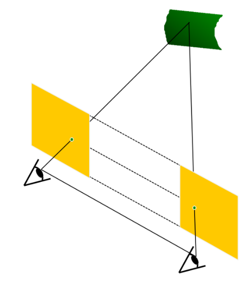

By assuming that 

- Image planes of cameras are parallel to each other and to the baseline.
- Camera centers are at the same height.
- Focal length are the same.

We can deduce that epipolar lines fall along the horizontal scanlines of the images. 

### **Essential Matrix for Parallel Images:**

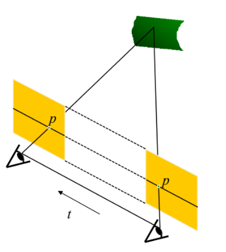

Epipolar constraint: 

$$R = I  \quad \quad t = (T, 0, 0)$$

$$p^T E p' = 0 \quad \quad E = [t_x]R$$

$$E = [t_x]R = \begin{bmatrix} 0 & 0 & 0 \\ 0 & 0 & -T \\ 0 & T & 0\end{bmatrix}$$

$$(u \quad v \quad 1)  \begin{bmatrix} 0 & 0 & 0 \\ 0 & 0 & -T \\ 0 & T & 0\end{bmatrix} \begin{pmatrix} u' \\ v' \\ 1 \end{pmatrix} = 0$$

$$(u \quad v \quad 1) \begin{pmatrix} 0 \\ -T \\Tv' \end{pmatrix} = 0$$

$$Tv = Tv'$$

Since T is nonzero, we see that 

$$v = v'$$

Therefore, the y-coordinates of corresponding points are the same. 

### Triangulation - Depth from Disparity

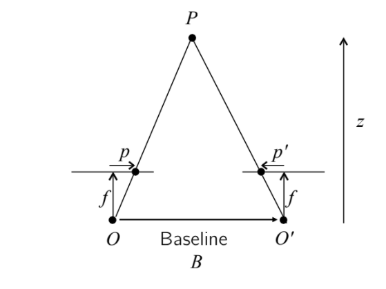

Assume we have already gotten the correspondences between p and p', then we can compute the depth of the point P from disparity. 

$$\text{disparity} = u - u' = \frac{B \cdot f}{z}$$

We can first compute the disparity by using (u - u'), which are the x-coordinates of the two points p and p'. Then we can compute depth z with disparity, Baseline B and focal length f known. 

As we can see from the equation, disparity is inversely proportional to depth. 

### Stereo Image Rectification

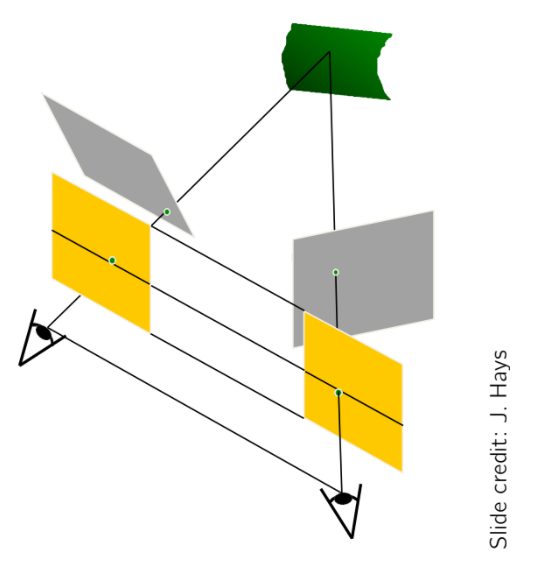

**Algorithm:** 

- Re-project image planes onto a common plane (shown in yellow) parallel to the line between optical centers
- Pixel motion is horizontal after this transformation
- Two transformation matrices, one for each input image reprojection

### Rectification Example and Application

**Rectification Example**

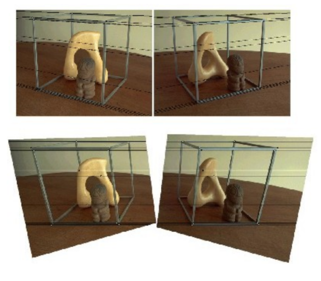

In this example, after rectifying the upper two images, we get two images which are horizontally aligned with each other. 

**Application: View Morphing**

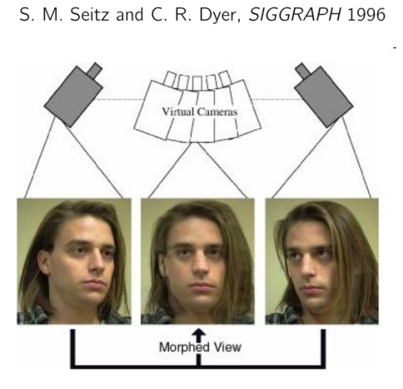

The rectification method can be used for View Morphing. As shown in the above example, if we have same objects from two different viewpoints, we can rectify them to get a synthesized morphed view of how the object looks like. 

**Removing Perspective Distortion** 

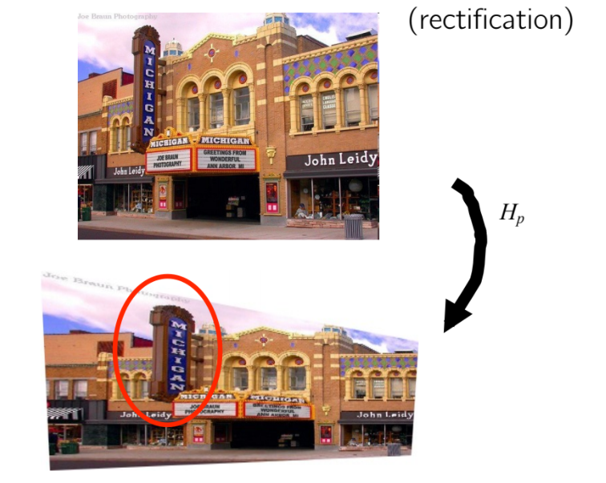

We can also use rectification to remove perspective distortion. For example, in the above image, we see that lines in the upper image are not parallel to each other. We can use rectification to transform the upper image to the lower image. 

One thing to note is that after rectification, we see that the Michigan sign is violating the constraint, this is because the sign is not really in the same image plane as the building. 

# Solving the Correspondence Problem

**Motivation.**  In this section we will look at solving the correspondence problem. 

Here is an example: 

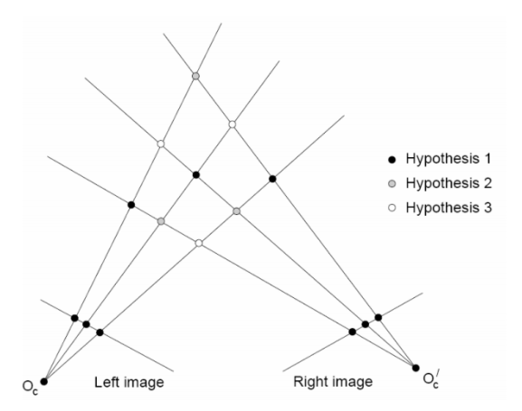

In the above diagram, there are multiple points from the left image as well as the right image. The different colors of dots at the intersection indicate different hypotheses of the alignments of these points. Our goal in this section is to find the matching points between two images from these multiple hypotheses. 

### Basic Stereo Matching Algorithm

We will use an example of two images of Abraham Lincoln to demonstrate the basic stereo matching algorithm. 

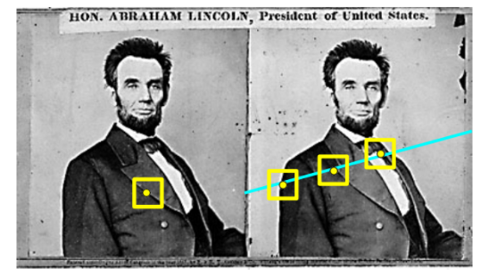

**The Basic Algorithm:** 

Take the pixel in the yellow square of the first image (left) as an example, 

- For each pixel in the first image:
    - Find corresponding epipolar line in the right image
    - Examine all pixels on the epipolar line and pick the best match
    - Triangulate the matches to get depth information

**Simplest Case:** 

The simplest case would be when the epipolar lines are horizontal scanlines. We can rectify the two stereo images to transform epipolar lines into scanlines, as shown below. 

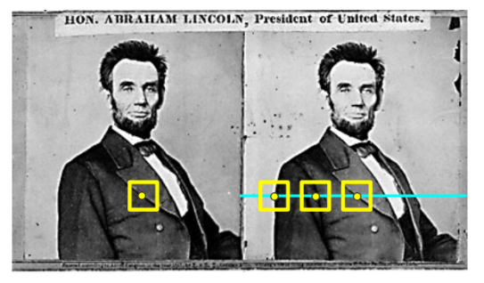

In this case, the algorithm would be： 

- For each pixel x in the first image:
    - Find corresponding epipolar scanline in the right image
    - Examine all pixels on the scanline and pick the best match x'
    - Compute disparity x-x' and set depth(x) = 1/(x-x')

### Correspondence Problem

Before we dive into how to pick the best match, let's first make some assumptions to simply the matching problem. 

- The baseline is relatively small compared to the depth of scene points.
- Given that the baseline is relatively small, most scene points are visible in both views.

    (If the base line is huge, then only a subset of points are visible in one view and the other different subset is visible in the other view. In this case, there won't be many overlapping points due to the different views of the object.) 

- Also, matching regions are similar in visual appearance.

    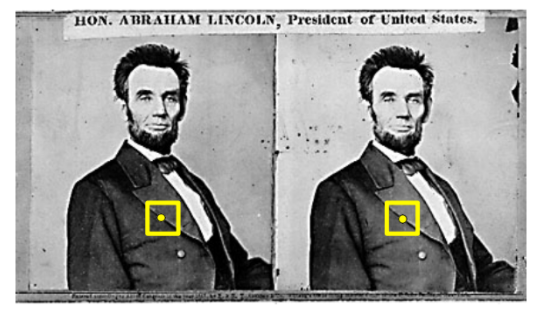

    In the example of two images of Abraham Lincoln, two yellow dots indicate the matching   points, and they both have the same unique texture of a collar. 

These assumptions give us the basis to find the best match: the points should be visible in both views and similar in visual appearance. 

### Correspondence Search with Similarity Constraint

If we assume that the matching points are similar in visual appearance, then we can search for the best match using a similarity constraint. 

Here is an example: 

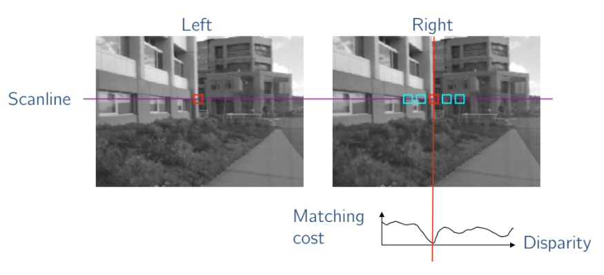

Assume that a point is in the red square of the left image, then we can find a scanline in the right image. For every pixel in the scanline, we can slide a window along the right scanline and compare contents of that window with the reference window in the left image. We can match them using different features such as SSD (sum of squared distance) and normalized correlation. 

Since we have assumed that the matching points are similar in visual appearance, we see that these points should have a lower matching cost or a higher normalized correlation. 

Therefore, after computing matching costs of the content of the reference window with that of the sliding window, we can complete the correspondence search by finding the lowest value of the SSD or highest value of the normalized correlation, as shown in the diagrams below. 

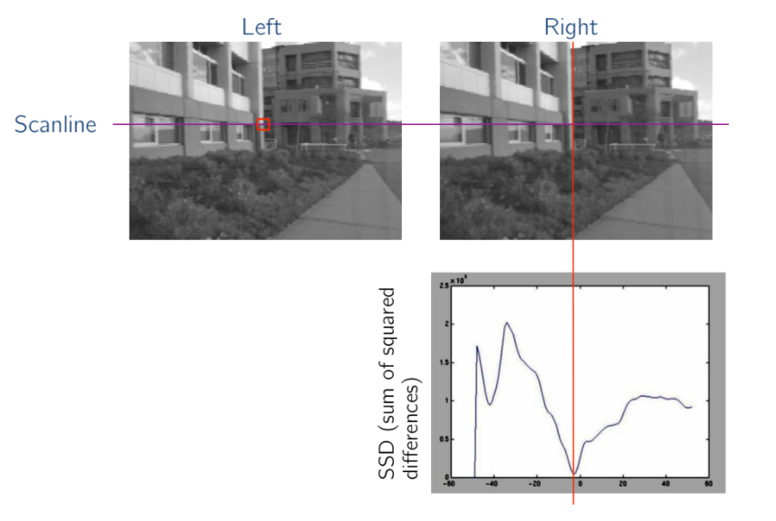

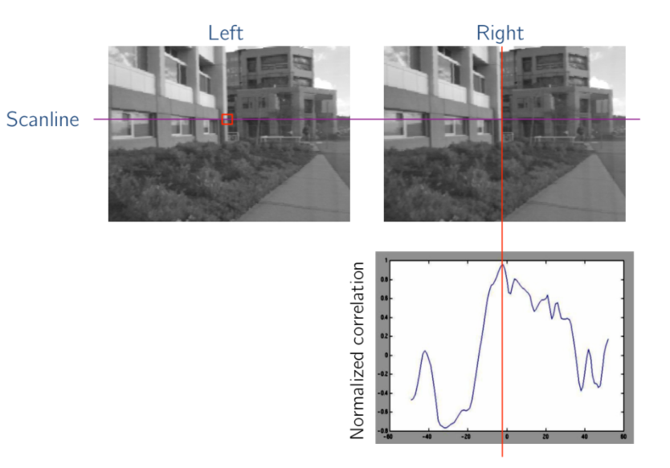

### Effect of Window Size

Window sizes also plays an important role in finding the matching points. 

**Smaller Window** 

- A smaller window size can give us more details since we are comparing very localized regions.
- It can also introduce more noise because it's less robust to small variations of textures and noises.

**Larger Window**

- A larger window size can give us smoother disparity maps.
- But it also includes less detail due to the larger size.

### Limitations of Similarity Constraint

In the similarity constraint, we assume that corresponding regions in two images should be similar in appearance, and non-corresponding regions should be different.  However, there are many cases when similarity constraint fails in finding the matching points. 

**Textureless surfaces**

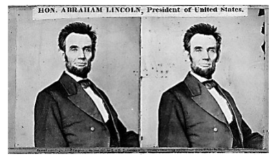

When the surface is textureless, the backgrounds of the two images consist of mostly pure colors. Then we won't be able to find the best matches given that a lot of points in the scanline can be similar to each other and to the reference point. 

**Occlusions, repetitions**

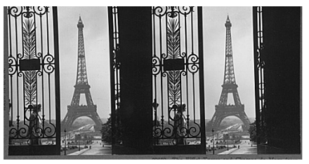

If the images contain repetition of objects, textures or structures, then we might find multiple high correlated areas and we don't know which point is the right matching point. 

If there's occlusion in the images, the similarity constraint is broken and objects can look quite different. Again, we won't be able to find the right match. 

**Specular surfaces**

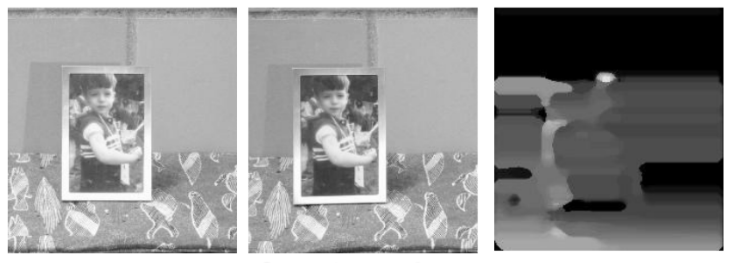

If there're specular surfaces in the images, then with a different viewpoint, certain parts of the specular surfaces can be much brighter and no longer similar to the their matching points. The rightmost image above is the result from such disparity because of the specular regions. 

### Results with Window Search

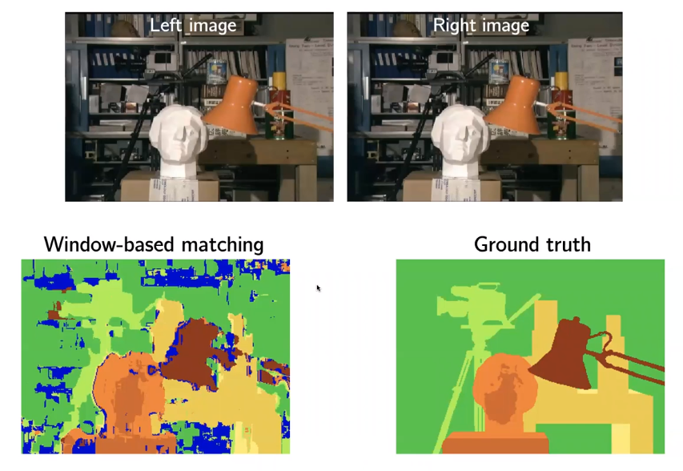

The bottom left image is the result from window-based matching and the bottom right image shows the ground truth. 

You can take CS231a to learn more (and better) methods such as graph cuts to solve this problem!

### The Role of the Baseline

**Small Baseline**

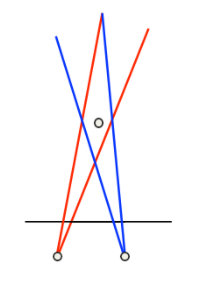

- We have been assuming a smaller baseline, because we will be able to see more shared points in both views and visual appearance will be similar.
- However, smaller baselines give us less information about depth and can lead to large depth error.

**Large Baseline**

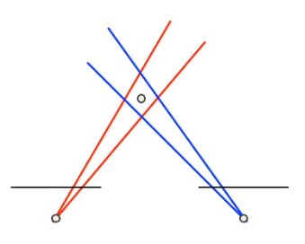

- Large baselines can make the search problem difficult, because a point in one image may not appear in the other, and even if it appears, the appearance might be quite different in the two views.
- Another related issue for wide baselines is **foreshortening**.

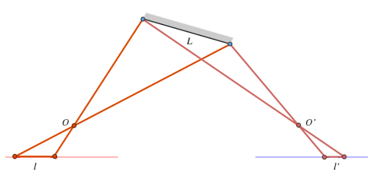

As we can see in the above diagram, line l is the projection of line L from O and line l' is the project of line L from O'. Line l' is much shorter than line l and matching with fixed-size windows will fail in this case. 

Possible solution is to adaptively vary window size or model-based stereo (CS231a).